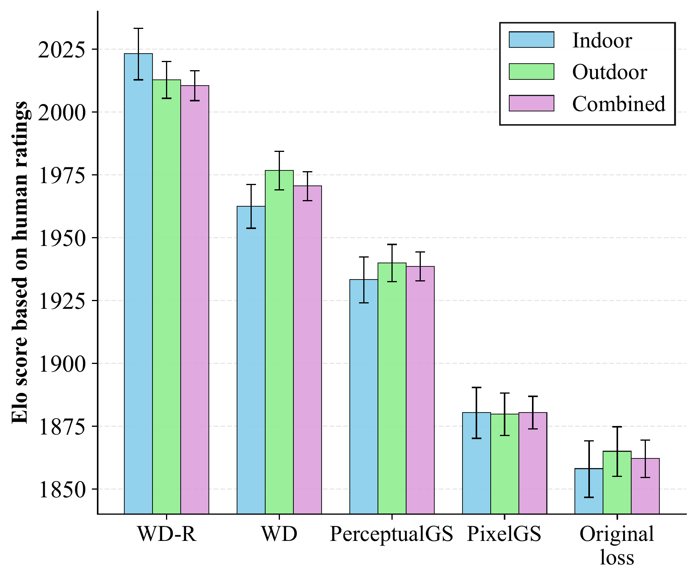
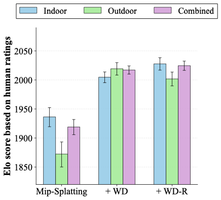
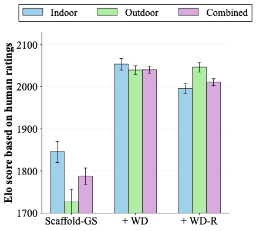

# Drop-In Perceptual Optimization of 3D Gaussian Splatting

This repository accompanies the research paper [**"Drop-In Perceptual Optimization of 3D Gaussian Splatting"**](https://arxiv.org/abs/2603.23297). 

**Authors:** Ezgi Ozyilkan<sup>1,2,\*,‡</sup>, Zhiqi Chen<sup>1,\*</sup>, Oren Rippel<sup>1</sup>, Jona Ballé<sup>2</sup>, Kedar Tatwawadi<sup>1</sup>

<sup>1</sup>Apple &nbsp;&nbsp;&nbsp; <sup>2</sup>Tandon School of Engineering, New York University

<sup>\*</sup>Equal contribution &nbsp;&nbsp;&nbsp; <sup>‡</sup>Work was done during an internship at Apple.

---

## Overview

3D Gaussian Splatting (3DGS) models are typically trained with linear combinations of pixel-level distortion metrics, which can result in blurry renderings. To address this, we explore perceptual optimization of 3DGS, comparing three types of alternative distortion losses:

- The ubiquitous **L1+SSIM loss** used in the original 3DGS work
- A **composite loss** consisting of several popular perceptual image metrics
- **Wasserstein Distortion (WD)**, a recently proposed distortion metric based on local texture statistics

We conduct **the first large-scale human subjective study on 3DGS**, involving **39,320 pairwise ratings from 428 participants** across novel views rendered from indoor and outdoor scenes.

### Key Results

A regularized version of WD (which we call **WD-R**) emerges as the clear winner, excelling at recovering fine textures without incurring a higher splat count.

- **WD-R is preferred by raters more than 2.3× over the original 3DGS loss**
- **WD-R is preferred 1.5× over the current state-of-the-art on perceptual metrics**
- **WD-R generalizes as a drop-in replacement**: preferred 1.8× over Mip-Splatting's default loss, and 3.6× over Scaffold-GS's default loss
- Consistently achieves state-of-the-art **LPIPS, DISTS, and FID** scores across various datasets
- Enables **≈50% bitrate savings** for comparable perceptual metric performance in 3DGS scene compression

---

## Human Preference Study

We report human preference results for indoor and outdoor scene datasets separately, and also for all scenes combined. The methods considered include WD, WD-R, PerceptualGS, PixelGS, and the original 3DGS loss.



As shown in the figure above, **WD-R achieves significantly better Elo scores across all scenes**. The difference in Elo of more than 150 as compared with the original loss suggests that the WD-R reconstructions were chosen by raters 2.3× as often. Compared with the state-of-the-art method, PerceptualGS, both WD and WD-R achieve better Elo scores (within the 95% error margin).

### Generalization to Other 3DGS Frameworks

To demonstrate that WD-R serves as a drop-in perceptual loss, we conduct additional human preference studies with Mip-Splatting and Scaffold-GS.

| |  |  |
|---|---|---|

- **Mip-Splatting**: WD-R achieves an Elo difference of 105.7 over the default loss (4,880 pairwise votes from 86 participants), preferred **1.8×** as often.
- **Scaffold-GS**: WD-R achieves an Elo difference of 223.2 over the default loss (3,720 pairwise votes from 93 participants), preferred **3.6×** as often.

Overall, across all three frameworks (3DGS, Mip-Splatting, Scaffold-GS), WD-R is consistently preferred by participants over all other methods, totaling **39,320 pairwise ratings from 428 participants**.

---

## Interactive Viewer

Visit our [project page](https://apple.github.io/ml-perceptual-3dgs/) for an interactive comparison tool that allows you to:

- Compare WD-R against other methods side-by-side
- Use an interactive slider for detailed visual comparisons
- Browse multiple scenes from indoor and outdoor datasets

---

## Dataset

We follow the dataset configuration from [Perceptual-GS: Scene-adaptive Perceptual Densification for Gaussian Splatting](https://arxiv.org/abs/2506.12400). Please refer to their [repository](https://github.com/eezkni/Perceptual-GS) for dataset access.

Our reconstructions using the WD and WD-R losses are available [here](https://ml-site.cdn-apple.com/datasets/perceptual-3dgs/perceptual_3dgs.zip).

---

## Acknowledgments

This work builds upon the following open-source projects:

- **3D Gaussian Splatting**: [graphdeco-inria/gaussian-splatting](https://github.com/graphdeco-inria/gaussian-splatting)
- **Wasserstein Distortion**: [balle-lab/wasserstein-distortion](https://github.com/balle-lab/wasserstein-distortion)

Please follow the license of 3D Gaussian Splatting and Wasserstein Distortion. We thank all the authors for their great work and repositories.

We also thank all participants in our human preference study for their valuable feedback and ratings.

---

## License

This project is licensed under the following license:

- Code: [Apple Sample Code License](./LICENSE)
- Our reconstructions: [CC-BY-NC-ND](./LICENSE_DATA) [Deed](https://creativecommons.org/licenses/by-nc-nd/4.0/).

---

## Citation

If you find our work useful, please cite:

```bibtex
@article{drop-in,
title = {Drop-In Perceptual Optimization for 3D Gaussian Splatting},
author = {Ezgi Özyılkan and Zhiqi Chen and Oren Rippel and Jona Ballé and Kedar Tatwawadi},
year = {2026},
URL = {https://arxiv.org/abs/2603.23297}
}
```
